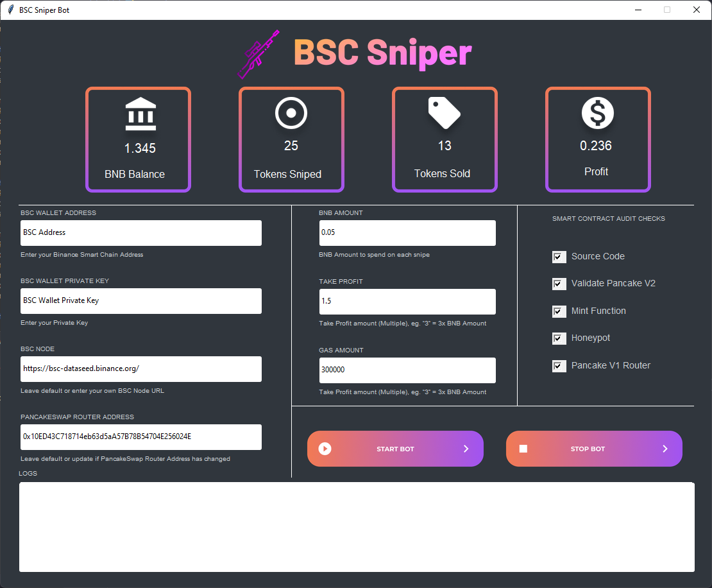
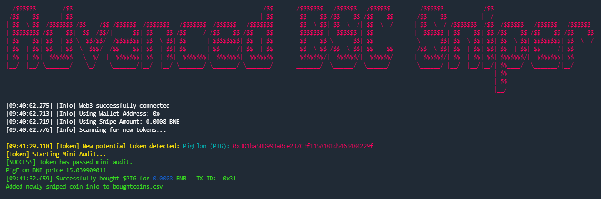
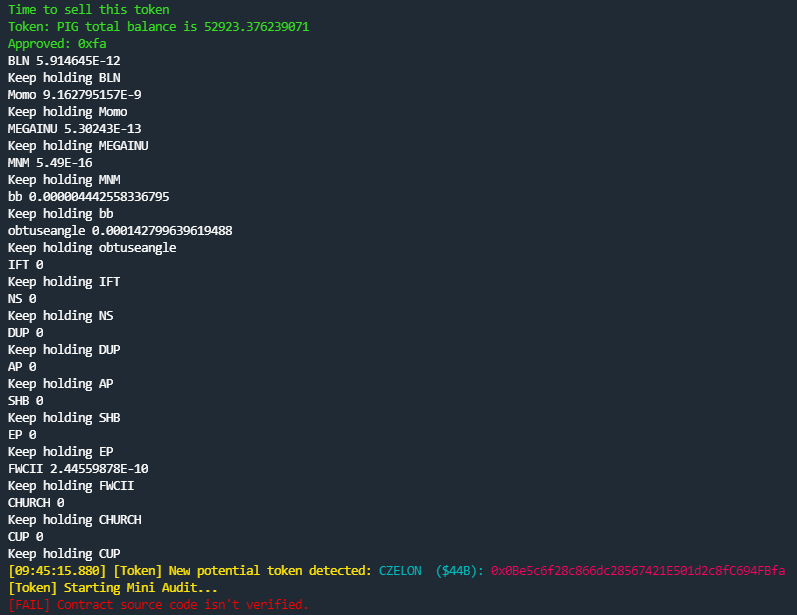

# Automated BSC Token Sniper - Buy and Sell 
An advanced python bot which automatically buys tokens on the Binance Smart Chain as soon as it detects that a liquidity pair has been created and then sells the tokens when your desired profit threshold is met. 

## GUI Preview (Coming Soon - In Development)

## Prerequisites
- Python 3 or greater
- A BSCScan API key (Free of charge. Simply [Create an account on BSCScan](https://www.bscscan.com/register) and then generate a free API key)
- A BSC wallet address and private key. You can easily create one with the Binance Wallet browser extension from [Chrome/Chromium-based browsers](https://chrome.google.com/webstore/detail/binance-wallet/fhbohimaelbohpjbbldcngcnapndodjp) or [Firefox](https://addons.mozilla.org/en-US/firefox/addon/binance-chain/)
- A large enough BNB balance in your wallet to successfully snipe tokens.

## Setup
1)	Install all dependencies `pip install -r requirements.txt`
2)	Edit `config.json` file with your node URL (or leave default), wallet address, private key, sellProfit, Amount to spend per snipe and BSCScan API key.
3)	Run `python tokenSniper.py` to start the program and start sniping! $$$$

## Configuration File (_config.json_)

When you download the bot, you will find a config.json file. This is where you need to add the following data.

- **bscNode**: The BSC node to use. By default it's set to the public Binance node but I **_HIGHLY RECOMMEND using a private node_** such as [QuickNode](https://www.quicknode.com?tap_a=67226-09396e&tap_s=2709976-ea3298&utm_source=affiliate&utm_campaign=generic&utm_content=affiliate_landing_page&utm_medium=generic) in order to make much faster snipes and get an edge on the competition.
- **walletAddress**: your public BSC wallet address
- **walletPrivateKey**: the private key of your wallet address (Note: your private key is only stored securely locally)
- **amountToSpendPerSnipe**: The amount of BNB you want to use for each token buy. (e.g. 0.01 means each successful snipe will buy 0.01 BNB worth of the token)
- **transactionRevertTimeSeconds**: Time to spend before transaction reverts. Recommended to leave at default.
- **gasAmount**: amount of max gas to use per transaction. Recommended to leave at default.
- **gasPrice**:  max price of gas to use per transaction. Recommended to leave at default.
- **bscScanAPIKey**: Your API key from BscScan.
- **sellOnlyMode**: enabling this will disable buying of coins but still monitors your currently held coins to sell when desired profit is reached. It also still allows you to see how the bot snipes new tokens, it just doesn't buy them. I recommended to set this to 'True' at the start to make sure you configured everything correctly so the bot can successfully scan for new tokens.
- **sellProfit**: The target profit multiplier for a token to reach for the sell function to be called. (eg. 3 would mean a token needs to 3x from the initial buy price before it's sold - if the bot buys a token at 0.01 BNB/each then the bot will wait for it to be worth 0.03 BNB/each to sell)

## Description

The aim of the Automated Buy/Sell BSC Token Sniper is to buy new tokens with a specified amount of BNB, with the aim of the price rising. Once the price has risen to your desired profit amount, the program will attempt to sell the coins back for BNB to secure your profits.

 It can check if:
-	Source code is verified.
-	If valid PancakeSwap v2 router is being used 
-	If a mint function exists
-	If it is a potential honeypot
-	That the PancakeSwap v1 router address is not being used.

The user can decide whether to enable the mini audit or turn it off (keep in mind you will likely be investing in a lot of scam-coins if you don’t enable these settings).

Once the token has/hasn't been through a mini audit the bot will then attempt to buy X amount of tokens with the specified amount of BNB.
The bot will buy the tokens directly through the Binance Smart Chain using the PancakeSwap v2 router and factory address, as it is much quicker than the PancakeSwap web interface. 

The program will continuously scan your currently held tokens to monitor the current price of each. When the price reaches the **sellProfit** you defined in the `config.json` file, it will attempt to sell the tokens back into BNB.

By avoiding web interfaces & Metamask and interacting directly with the BSC nodes, you can snipe tokens faster than any of the web-based platforms which allows tokens to be sniped almost instantly. This is especially true by using private nodes such as [QuickNode](https://www.quicknode.com?tap_a=67226-09396e&tap_s=2709976-ea3298&utm_source=affiliate&utm_campaign=generic&utm_content=affiliate_landing_page&utm_medium=generic).  During our testing using the bot with [QuickNode](https://www.quicknode.com?tap_a=67226-09396e&tap_s=2709976-ea3298&utm_source=affiliate&utm_campaign=generic&utm_content=affiliate_landing_page&utm_medium=generic), we found the bot would typically buy within the first 1-3 buy transactions of all tokens it found. Keep in mind that the bot does incur a small fee for each successful snipe. 

## Token check/audit

The bot has an optional mini audit feature which aims to filter some of the scam coins (eg. wrongly configured, honeypots). This attempts to ensure that the coins the bot will buy are of higher quality and if you enable the audit options, the automated sell functionality should allow you to secure a healthy profit on the successful tokens (provided the token hasn't been rug-pulled).

The following json entries are for the mini audit settings. Set all of them to false to disable mini audits, although beware you will probably be buying a lot of scam coins.
- **checkSourceCode**: checks if source code is verified. This function is needed for all the other functions so if you disable this be sure to disable all the other audit options. **_Highly Recommended_**.

- **checkValidPancakeV2**: checks if the correct PancakeSwap v2 router address is used in the code. Be aware some contracts may externally set their router address so this function may reject a potentially good token. Not recommended.

- **checkMintFunction**: checks if a mint function is present in the code. Recommended.

- **checkHoneypot**: checks the code to see if it might be a honeypot (where you can buy tokens but cannot sell). Recommended.

- **checkPancakeV1Router**: checks to see if the PancakeSwap v1 router address is used in the code. You will not be able to sell the tokens later on if PCS v1 router address is used. Highly recommended.

**_Note_**: be very careful when editing config.json and make sure to not alter the syntax. For mini audit options, either use “True” or “False” making sure to capitalise the 1st letter. It won't work with any other spelling/capitalisation.

### Things to note

-	Do not worry if you are not seeing any new tokens being detected. There are often around 10-20 new tokens being created per minute but that can vary quite a lot. Sometimes no new tokens may be detected for a few minutes.

-	The bot only buys tokens whose liquidity is paired with Wrapped BNB (WBNB). You could alter the code to buy tokens paired with another currency if you wanted.
-	Please check that you have enough BNB in your wallet to afford sniping new tokens. If you don’t the bot will not work.
-	Please be careful when editing the config.json file. If you delete a comma or quotation mark etc. the bot will not work and throw an error.
-   You can use PowerShell or WSL2 and ensure you have Python3+ installed if you're a Windows user. If you're a Mac/Linux user, simply use the Terminal.

## FAQs

I keep getting ‘Transaction failed’ – what’s going on?
Either:
-	Gas amount / price too low
-	Wallet address / private key incorrect
-	Not enough BNB to pay for the token and TX fees

The bot isn’t sniping that fast (eg. couple seconds between detection and buying)
- This is mainly due to the node you're using. I highly recommend using a private node, eg. [QuickNode](https://www.quicknode.com?tap_a=67226-09396e&tap_s=2709976-ea3298&utm_source=affiliate&utm_campaign=generic&utm_content=affiliate_landing_page&utm_medium=generic)
- To a lesser extent, internet speed and your computer's processing power are also factors to consider. 

The bot isn't successfully selling my tokens when they hit the desired profit.
- This is often due to there being not enough liquidity in the pool for that token. The bot will continue to retry selling the coin at regular intervals until it's successful.

## Screenshots

## Risks:

Investing in BSC tokens / shitcoins is risky and be aware you could lose all your money. For this reason, do not invest more money than you are prepared to lose.
It is pretty much impossible to snipe bots very early and be sure it isn’t a rug pull. When people create tokens in most situations, they will manually create liquidity in PancakeSwap. This is when the bot will detect the token. If they burn / lock liquidity, they will then usually send their LP tokens manually to a deadcoin address or put them in a liquidity locker. Therefore, you can’t immediately snipe the tokens with 100% certainty they aren’t rugpulls.

The mini audit feature can’t be 100% accurate but aims to filter out the majority of scams / hacks and reduce the chance of losing your money.
If a programmer creates token code in a unique way, they may be able to bypass detection although this is generally quite rare, as the majority of tokens are forks of big projects with very little of the code having been changed e.g., Safemoon.

*Greets to @eddiemuro123 for the original codebase. I built upon his foundations to integrate the pricing and auto-sell functionality.*

